# Zero Gap 프로젝트 에이전트 가이드

이 문서는 AI 에이전트가 "Zero Gap" Android 프로젝트를 이해하고 효율적으로 작업할 수 있도록 돕기 위해 작성되었습니다.

## 1. 프로젝트 개요
- **이름**: Zero Gap
- **플랫폼**: Android
- **설명**: GDG 2026 관련 모바일 프로젝트 (Zero Gap)

## 2. 기술 스택
- **언어**: Kotlin (JVM Target 11)
- **빌드 시스템**: Gradle (Kotlin DSL, `*.gradle.kts`)
- **Android SDK**: compileSdk 36, minSdk 24, targetSdk 36
- **UI 프레임워크**: XML Layout (ViewBinding 사용)
- **주요 라이브러리**:
    - AndroidX Core KTX
    - AppCompat
    - Material Components
    - ConstraintLayout

## 3. 프로젝트 구조
```text
Zero_gap/
├── app/
│   ├── build.gradle.kts      # 앱 모듈 빌드 설정
│   └── src/
│       ├── main/
│       │   ├── java/gdg/mobile/zero_gap/
│       │   │   ├── MainActivity.kt    # 메인 화면 액티비티
│       │   │   └── KawaiActivity.kt   # 카와이 화면 액티비티
│       │   ├── res/
│       │   │   ├── layout/            # UI 레이아웃 파일 (activity_main.xml 등)
│       │   │   └── ...
│       │   └── AndroidManifest.xml    # 앱 매니페스트
└── build.gradle.kts          # 루트 프로젝트 빌드 설정
```

## 4. 코딩 규칙 및 주의사항
- **ViewBinding**: 모든 액티비티에서 ViewBinding을 활성화하여 UI 요소에 접근합니다. 직접 `findViewById`를 사용하는 것을 지양합니다.
- **리소스 관리**: 문자열, 색상, 치수 등은 `res/values` 하위의 XML 파일에 정의하여 관리합니다.
- **KTS 사용**: 모든 Gradle 설정 파일은 Kotlin DSL(`.gradle.kts`)을 사용합니다.

## 5. 개발 워크플로우
- **빌드**: `./gradlew assembleDebug` 명령을 통해 빌드합니다.
- **설치**: `./gradlew installDebug` 명령을 통해 연결된 기기에 설치합니다.
- **테스트**: `./gradlew test` (Unit Test) 또는 `./gradlew connectedAndroidTest` (UI Test)를 실행합니다.

---

## 6. 화면 구조 설계 (Screen Design)

### 하단 탭 내비게이션 구조
1. **홈 (Home)**: 대시보드 및 요약 정보 (연속 기록, 완료 도전 수 등)
2. **챌린지 (Challenge)**: 행동 실천 및 멘탈 챌린지 관리 (인증 기능 포함)
3. **일기 (Diary)**: 감정 기록 및 달력 뷰 (오늘의 인용구 포함)
4. **리포트 (Report)**: AI 기반 성취 및 감정 분석 리포트
5. **마이 (My)**: 프로필 및 개인 설정

### 화면 흐름도 (Screen Flow)

```mermaid
graph TD
    Splash[스플래시 화면] --> Login{로그인 여부}
    Login -- No --> Signin[로그인/회원가입]
    Login -- Yes --> MainTab[메인 하단 탭]
    
    subgraph "Main Navigation"
        MainTab --> Home[홈: 대시보드]
        MainTab --> Challenge[챌린지: 행동 실천]
        MainTab --> Diary[일기: 감정 달력]
        MainTab --> Report[리포트: AI 분석]
        MainTab --> My[마이: 프로필]
    end

    Home --> ChallengeDetail[챌린지 상세/인증]
    Home --> DiaryEntry[감정 기록하기]
    
    Challenge --> ChallengeDetail
    Challenge --> ChallengeSearch[챌린지 탐색]
    
    Diary --> DiaryDetail[특정 날짜 일기 상세]
    Diary --> DiaryEntry
```


### 주요 UX 포인트
- **AI 격려 시스템**: 챌린지 완료 및 감정 기록 시 AI의 맞춤형 격려 메시지 노출.
- **3일 복귀 트리거**: 3일 이상 미접속 시 홈 상단에 가벼운 행동 유도 위젯 노출.

---
---
---

## 취업난

서브 키워드: 검증, 실전, 전략, 멘탈 중 택 1 

### 심사기준

- 주제 적합성 → 20
- 창의 혁신성 → 20
- 실현 가능성 → 20
- 완성도  → 20

---

- 아이디어
    
    ### Zero-Gap — 취업 공백기 번아웃 탈출 & 실전 준비 앱
    
    ---
    
    서브 키워드 선택: **멘탈 + 전략 (복합형)** → 멘탈 케어 + 스펙 개선 전략 제시까지 연결
    
    ### 개요
    
    > 취업난 속에서 많은 준비생들이 “능력 부족”이 아니라 **번아웃 + 방향 상실** 때문에 무너진다.
    > 
    
    **⇒ Zero-Gap은 취업 공백기를 행동 기록 + 감정 분석 + 작은 실천으로 관리하는 번아웃 탈출 앱이다.**
    
    ### **핵심 컨셉**
    
    공백기 = 실패가 아니라 → **데이터로 관리 가능한 상태**
    
    ### 핵심 기능
    
    1. **핵심 기능1 —  행동 첼린지** 
        - **설명 :** 
        번아웃 상태에서 가장 어려운 건 “큰 목표”가 아니라  👉 **첫 행동 시작**
        그래서 거창한 목표 가 아닌 즉시 가능한 도전 을 알려준다
        - **핵심 기능 : 시간선택**
            - 짧게 (5~10분)
            - 중간 (20~30분)
            - 길게 (1시간+)
        - **예시 :**
            - 코테 1문제
            - 이력서 한 줄 수정
            - 책 10쪽
            - 산책
            - 카페 가기
            - 공부 15분
    2. **핵심 기능 2 — 감정 일기 (멘탈 추적)**
        - **입력**
            - 감정 점수
            - 한줄 기록
        - **출력**
            - 달력 감정 표시
            - 감정 추이 그래프
    3. **핵심 기능 3 - 3일 미사용 복귀 트리거**
    **👉** 재접속 유도 시스템
        - **조건**
        - **알림**
            
            > “다시 시작은 1줄 기록이면 충분합니다”
            > 
    4. **성취 기록 & 시각화**
        - 요소
            - 완료 도전 수
            - 연속 기록 일수
            - 감정 평균
            - 오늘 성공 여부
        
        → 대시보드 표시
        
        ---
        
    
- API
    
    ## API
    
    - 행동 챌린지
        - 오늘의 행동 요청
            - 지금까지의 행동 챌린지 완료 내역을 컨텍스트로 하여 AI가 오늘의 행동 반환
            - Param: [Duration] 선택한 투자 시간
            - Returns: [List<String>] List of 행동
        - 오늘의 행동 등록
            - 오늘의 행동을 미완료 상태로 등록
            - Param: [String] 행동
            - Returns: [String] (AI의 응원 메시지?)
        - 오늘의 행동 완수
            - 오늘의 행동을 완료 상태로 변경
            - Param: [String] (Optional) 오늘의 행동에 대한 사용자의 부가적인 서술 (뭘 더 했다, 어떤 것을 느꼈다)
            - Returns: [String] AI의 격려 메시지
        - 행동 조회
            - Returns: [List<Behavior>] List of (행동, 완료 여부, 부가 서술)
        - 감정 일기
            - 오늘의 감정 등록
                - Param: [String] 감정, [String] 부가 서술
            - 감정 조회
                - Param: [LocalDate] 조회 시작 날짜, 조회 끝 날짜
                - Returns: [List<Emotion>] List of (감정, 부가 서술)
        - 기록 & 시각화
            - AI의 종합 한줄평 요청??
        - 타입
            - Behavior
                - String 행동
                - Boolean 완료 여부
                - String 부가 서술
            - Emotion
                - String 감정
                - String 부가 서술
        
        | **구현 여부** | **메소드** | **URL** | **설명** | **쿼리파라미터** | **요청(헤더)** | **요청(바디)** | **응답** |
        | --- | --- | --- | --- | --- | --- | --- | --- |
        | Auth |  |  |  |  |  |  |  |
        |  | POST | {baseUrl}/auth/login | 로그인 |  |  | {”email”: “name@domain.com”,
         “password”: “password”} | {”accessToken”: “…”} |
        | User |  |  |  |  |  |  |  |
        |  | POST | {baseUrl}/users | 회원가입 |  |  | {”name”: “홍길동”,
         “email”: “name@domain.com”,
         “password”: “password”} |  |
        |  | GET | {baseUrl}/users/me | 내 정보 조회 |  | {”Authorization”: “Bearer …”} |  | {”id”: 1, ”name”: “홍길동”} |
        | Mission |  |  |  |  |  |  |  |
        |  | GET | {baseUrl}/missions | 기간 내 미션 조회 | startDate=2020-01-01&endDate=2020-01-02 | {”Authorization”: “Bearer …”} |  | {”missions”: [
          {”id”: 11, ”name”: “책 한 권 읽기”, “date”: “2020-01-01” “accomplished”: true, “description”: “Clean Code를 읽었다.”},
          …,
        ]} |
        |  | GET | {baseUrl}/missions/today | 오늘의 미션 요청 | durationInSeconds=3600 | {”Authorization”: “Bearer …”} |  | {”missionRecommendations”: [”책 한 권 읽기”, “한 시간 운동하기”, “코딩 문제 하나 풀기”, …]} |
        |  | POST | {baseUrl}/missions | 미션 등록 |  | {”Authorization”: “Bearer …”} | {”name”: “책 한 권 읽기”, “date”: “2020-01-01”} | {”id”: 11, “cheerMessage”: “취업에 필요한 기술을 배우거나 마음의 양식을 쌓아 봐요!”} |
        |  | PATCH | {baseUrl}/missions/{missionId} | 미션 완수 |  | {”Authorization”: “Bearer …”} | {”accomplished”: true, “description”, “Clean Code를 읽었다.”} | {”cheerMessage”: ”훌륭합니다! Clean Code는 …”} |
        | Emotion |  |  |  |  |  |  |  |
        |  | GET | {baseUrl}/emotions | 기간 내 감정 조회 | startDate=2020-01-01&endDate=2020-01-02 | {”Authorization”: “Bearer …”} |  | {”emotions”: [
          {”id”: 21, ”name”: “뿌듯함”, “date”: “2020-01-01”, “description”: “다른 날과 비교해 무언가 이룬 것 같아서 기분이 좋다.”},
          …,
        ]} |
        |  | POST | {baseUrl}/emotions | 감정 등록 |  | {”Authorization”: “Bearer …”} | {”name”: “뿌듯함”, “date”: “2020-01-01”, “description”: “다른 날과 비교해 무언가 이룬 것 같아서 기분이 좋다.”} | {”id”: 21} |
        | Summarize |  |  |  |  |  |  |  |
        |  | GET | {baseUrl}/summary | 기간 내 데이터를 바탕으로 한 AI 한줄평 요청 | startDate=2020-01-01&endDate=2020-01-02 | {”Authorization”: “Bearer …”} |  | {”summary”: “매우 잘하고 계십니다! 내일도 …”} |

- **Daily_CHECK**
- **Emotion_logs**
- **Challenges**
- **Challenge_logs**
- **Achivements**
- **Streaks**
- **Midset_messages**

---

```
users
users_auth
user_info
selected_region
selected_homesize
selected_hometype
account
```